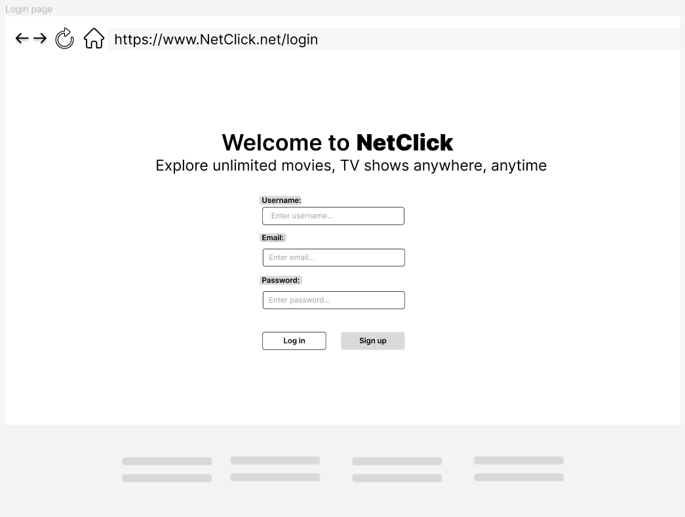
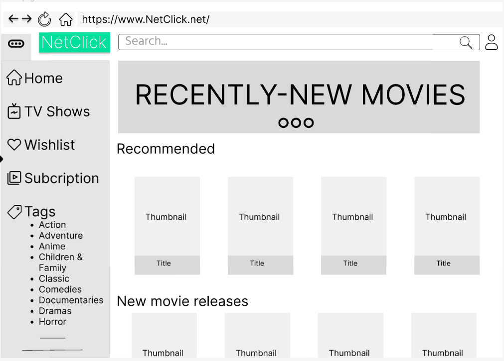
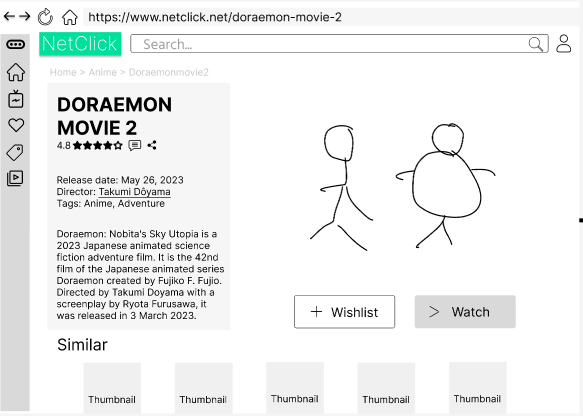
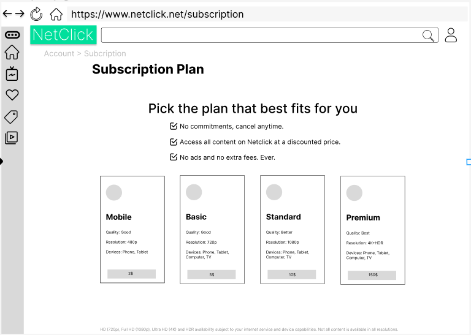

# NETCLICK - Booking cinema ticket app

## Table of contents

- [Wireframe](#wireframe)
- [Requirements](#requirements)

## Wireframe

Here is our [wireframe](https://www.figma.com/file/CB9zF3wsmZimnx8U83VW4C/NetClick?type=design&node-id=0-1&t=Aq8fdv3htqCGwmyM-0)

### Login page



### Home page



### Preview page



### Subscription page



## Requirements

### User features

**User Registration and Login**

```
• Users should be able to create an account and login to the application.
• User information should include name, email address, password.
```

**Movie Browsing and Searching**

```
• Users should be able to search for movies by title, actor or director.
• The application should display detailed information about each movie.
```

**Reviews and Ratings**

```
• Users should be able to write a review and rating movies.
• Users should be able to view movie’s review and rate.
```

**Ticket Purchasing**

```
• Users should be able to purchase tickets for watching movies.
• The application should display available ticket tiers.
• Users should be able to select their preferred purchase tickets using a credit card or other payment method.
```

**Transaction History**

```
• Users should be able to view their transaction history, including past purchases and upcoming ticket reservations.
```

### Admin Features

**Movie Management**

```
• Admins should beable to add, edit, and delete movies from the application.
• Admins should be able to upload trailers and promotional materials for each movie.
• Admins should be able to set showtimes and update availability for each movie.
```

**User Management**

```
• Admins should be able to view and manage user accounts, including resetting passwords and deleting accounts if necessary.
• Admins should be able to view user transaction history and refund purchases if necessary.
```
