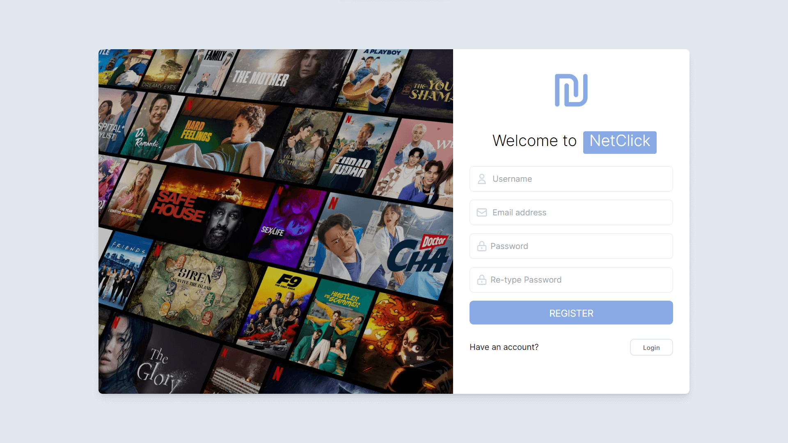
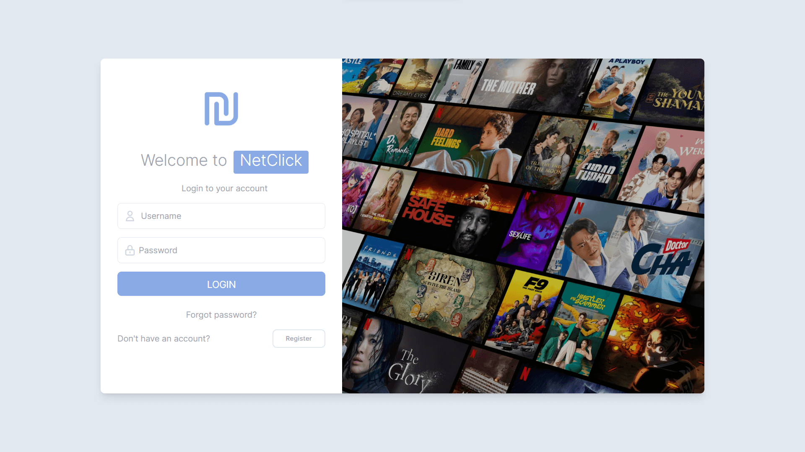
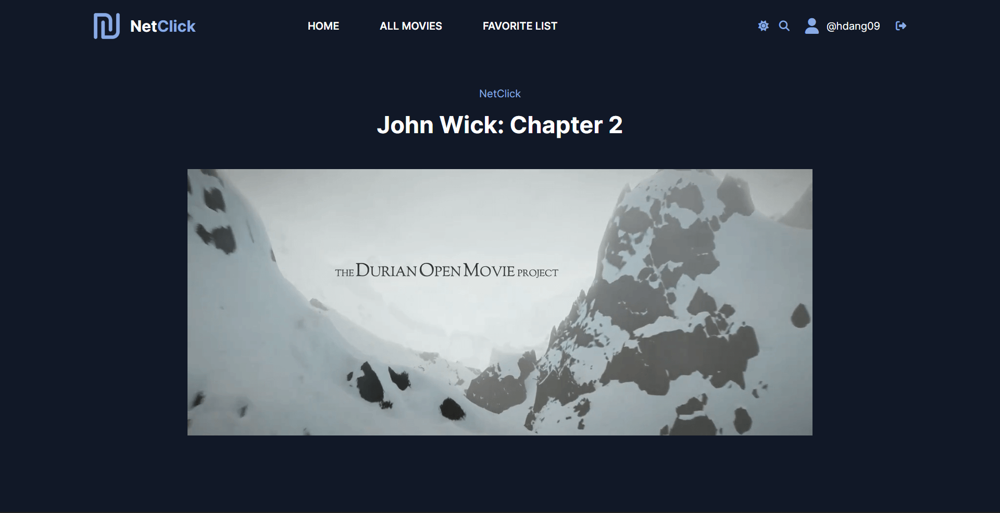
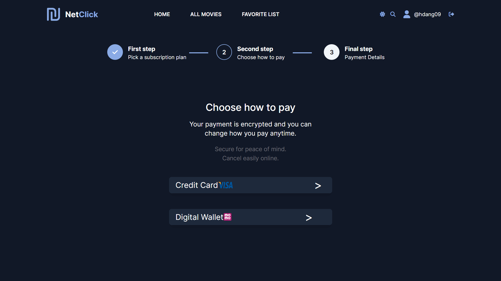
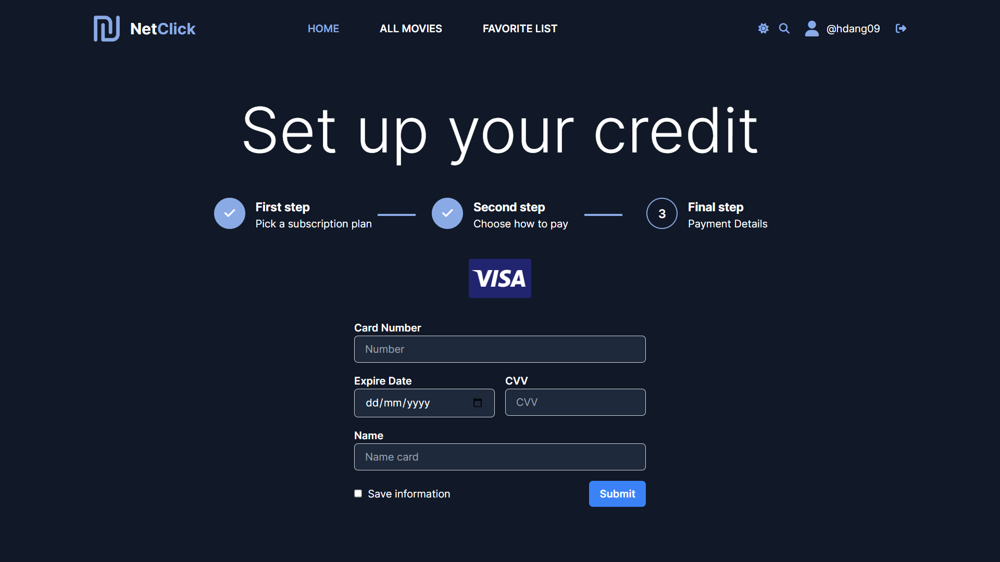
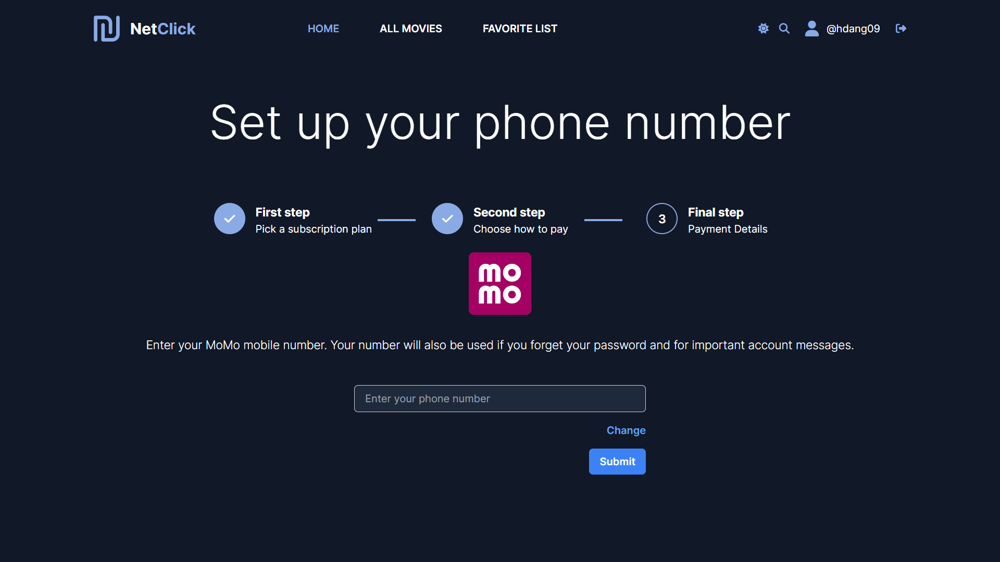
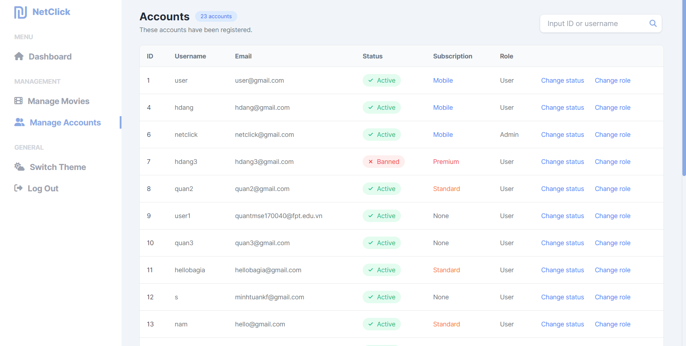
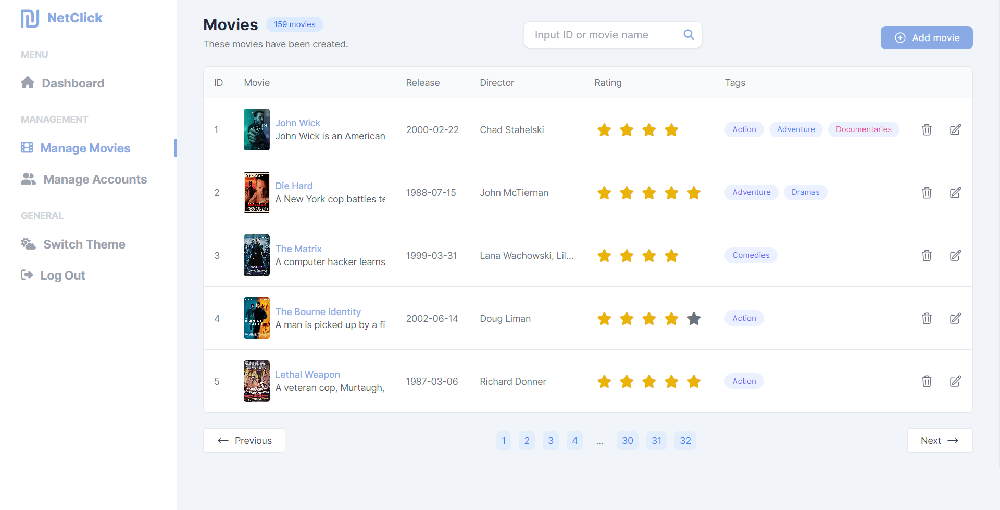
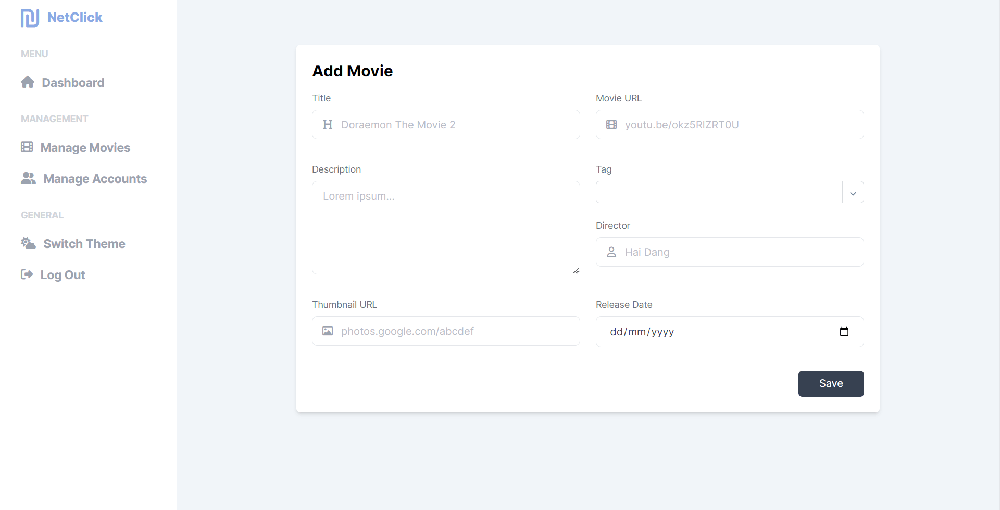
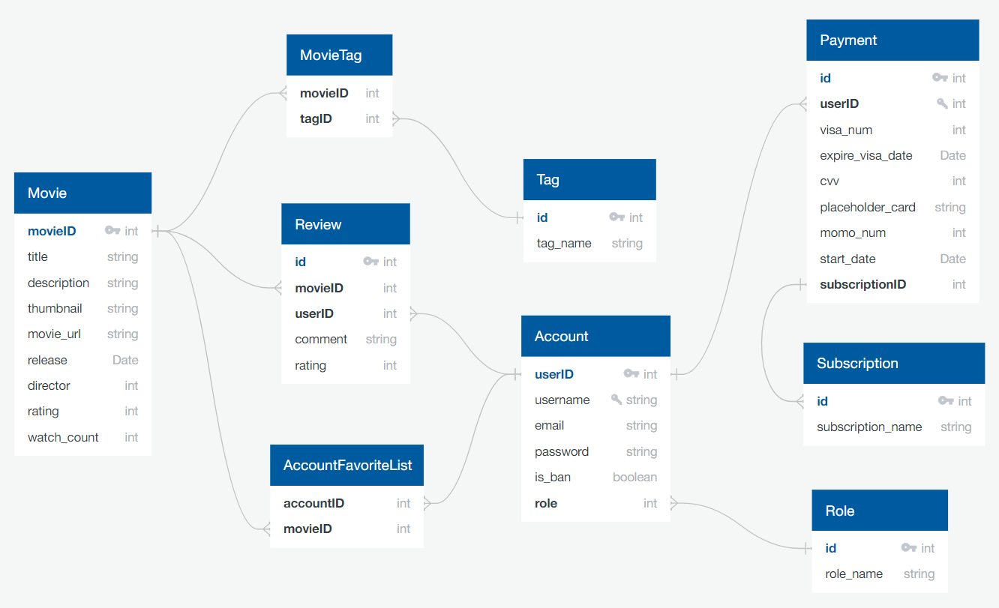

# NETCLICK - A Movie Web Application

    
    
NetClick is an internet-connected streaming service that operates on a subscription model

## 0. Introduction

- Team members:
  - Trần Hải Đăng
  - Trần Tấn Thành
  - Trần Minh Quân
- Technologies in use:
  - Tailwind CSS
  - Chart.js
  - JSP, Servlet
  - Microsoft SQL Server

## 1. Requirements

- **Name of your system**: NetClick
- **What is the purpose of the system**: To provide online movie browsing, searching, and watching, with admin features for managing accounts, and administering the movies.
- **Who use the system**: Movie enthusiasts and admins managing the movies and accounts.
- **List all features your system can do, arrange the features in a specific classification**:

### User features

**User Registration and Login**

   * The user registration and login feature enables users to create an account and securely log into the application. The login form requires users to enter their username and password, and the application verifies the credentials for authentication. If the entered password is incorrect, an error message is displayed.

   * The register form collects the user's desired username, email address, password, and re-typed password for confirmation. The application checks if the username already exists in the database and displays an error message if it is taken. It also ensures that the entered password matches the re-typed password and prompts the user to correct any mismatches.

   * The "Forgot password" feature allows users to recover their password if they forget it. Users can request a password reset by providing their registered email address. The system then sends them an email with a unique verification code or a special link. Upon clicking the link or entering the verification code, users can set a new password. This ensures that users can regain access to their accounts even if they forget their password.

   * User information, such as name, email address, and password, is stored to facilitate user identification and authentication.

**Movie Browsing and Searching**

   * The movie browsing and searching feature allows users to find movies based on different criteria. Users can search for movies by title, actor, or director. The application retrieves relevant movie information from its database based on the user's search input.

   * When a user selects a movie, the application displays detailed information about the movie. This includes a description of the plot, cast and crew details, ratings, reviews, release date, runtime, genre, and more. This comprehensive display helps users make informed decisions about the movies they want to watch.

   * The application also provides additional sections to enhance the browsing experience. The "Top List" section showcases popular movies, and the "Incoming Movies" section highlights upcoming releases. Additionally, the application offers recommendations based on user preferences and viewing history, suggesting movies that users might enjoy.

**Favorite feature**
   * The "+ Favorite" feature allows users to save movies they like or are interested in for easy access and future reference. When a user selects a movie and views its detailed information, the application provides an option to add the movie to their favorites list. This list can be accessed from the "Favorite List" section on the top website. 

**Reviews and Ratings**

   * Users have the ability to write reviews and provide ratings for movies using the reviews and ratings feature. They can share their opinions, thoughts, and experiences about a movie by writing a review. Additionally, users can rate movies based on their overall satisfaction or enjoyment level. The application also allows users to view reviews.

**Subscriptions Purchasing**

   * The ticket purchasing feature allows users to purchase subscriptions for watching movies. Users can choose from different subscription tiers such as weekly, monthly, or annually. The application displays available subscription options, including free and paid plans. Users can select their preferred subscription and proceed with the purchase using various payment methods such as credit cards, e-banking, ATMs, or Visa/MasterCard.

### Admin Features

**Movie Management**

- Admins should beable to add, edit, and delete movies from the application.
- Admins should be able to upload trailers and promotional materials for each movie.
- Admins should be able to set showtimes and update availability for each movie.

**User Management**

- Admins should be able to view and manage user accounts, including resetting passwords and deleting accounts if necessary.
- Admins should be able to view user transaction history and refund purchases if necessary.

## 2. Wireframe or screenshots of the system

You can view full our wireframe in here: [Figma](https://www.figma.com/file/CB9zF3wsmZimnx8U83VW4C/NetClick?type=design&node-id=0-1&t=Aq8fdv3htqCGwmyM-0)

### Register Page

When user didn't have any account, we can go to this page:

If username exists or retype password not match, it will show the message:

### Login Page

<!-- Here is the login page: -->

If the password is wrong, it will show the message:

### Home Page

<!-- Here is the home page: -->

### Preview Page

<!-- Here is the preview page for the film: -->

### Movie Page

If the user has purchased subscription, it will navigate to the **Movie page**

### Subscription Page

If the user hasn't purchased subscription, it will navigate to the **Subscription page**
 
\The user can choose which payment method to pay:

### Payment Page

Here is the page if the user choose to pay with credit card(Visa):
 
And here is with digital card(Momo):
 

### Dashboard Page (Admin)

### User Management Page (Admin)

### Movie Management Page (Admin)

### Movie Detail Page (Admin)

### Movie Form Page (Admin)

This page is used for creating and editing the movie

## 3. Database Design

You can view full our diagram in here: [QuickDBD](https://app.quickdatabasediagrams.com/#/d/o6Ffqs)

## 4. System Design
You can view full our diagram in here: [SystemDesign](https://www.figma.com/file/f8sMbLbsSoKWU1ytbPovD0/NetClick-System-Design?type=whiteboard&node-id=0-1&t=3IzNGSKUGcvnbUb0-0)

## 5. Conclusion and Discussion

### Pros of NetClick:

- Provides a comprehensive movie browsing and searching experience for users.
- Offers various subscription options for users to choose from.
- Allows users to mark movies as favorites and track their viewing history.
- Provides admins with the ability to manage movies and user accounts efficiently.
- Offers a transaction history feature for users to track their purchases.

### Cons of NetClick:

- The application may face competition from existing online movie streaming platforms.
- The application's success may depend on the availability of popular and quality movie content.
- The application may require a significant amount of resources to maintain and update its database regularly.

### What was learned during the development of NetClick:

- Developing an online movie streaming application requires significant effort and resources. Creating a robust system that meets user demands involves substantial investments in time, technology, and personnel.
- Ensuring the security of user information, particularly during the registration and login processes, is of utmost importance. Safeguarding user data and implementing secure authentication protocols such as password encryption and secure authentication protocols are essential.
- Tracking user preferences and viewing history is crucial for providing personalized recommendations and enhancing the user experience. Collecting information about user preferences and viewing history enables the system to offer tailored suggestions, thereby improving user satisfaction and engagement.
- Offering multiple payment options is vital for user convenience. Meeting user preferences for diverse payment methods, such as credit cards, bank transfers, ATMs, or Visa/MasterCard, enhances convenience and flexibility during the purchasing and payment process.
  In summary, during the development of NetClick, we learned the significance of user data security, tracking user preferences and viewing history, and providing diverse payment options to cater to user needs.

  <!-- - Developing an online movie streaming application requires a lot of effort and resources.
  - The importance of ensuring the security of user information, especially during registration and login processes.
  - The need to keep track of user preferences and viewing history to provide personalized recommendations and enhance the user experience.
  - The importance of offering multiple payment options for user convenience. -->

### Improvements for NetClick in the future:

- Integrate a feature that allows users to create watchlists for easy access to movies they plan to watch.
- Provide subtitles and dubbing options for users who prefer to watch movies in languages other than the original.
- Implement a feature that suggests movies based on real-time user activities such as search queries and browsing history.
- Offer a feature that provides users with recommendations for similar movies they may enjoy based on their ratings and reviews.
- Integrate with social media platforms to allow users to share their reviews and ratings with friends and followers.
